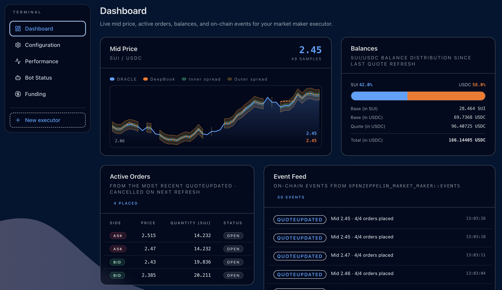

# Sui AMM

> This project has been professionally audited. See the security audit report in
[`audits/`](./audits). It is open source (MIT) and provided as a reference implementation / starter
template, not a hosted or operated service. It is no longer under active
maintenance: no new features, bug fixes, or updates should be expected. To
build on it, fork or clone this repository and deploy it under your own
control, and review (and re-audit) any changes you make before using it in
production.

End-to-end example of a small AMM on **Sui**

A Proprietary Automated Market Maker (Prop AMM) is a new DeFi primitive where a market-making algorithm is embedded on-chain, allowing an individual market maker (not a pool of passive LPs) to provide active liquidity with real-time quote updates. This model shifts away from traditional constant-product or even concentrated AMMs by letting the on-chain program continuously adjust its prices independently of trades. The result is tighter spreads and more competitive pricing that can rival centralized exchanges

This repo is a pnpm workspace containing:

- Move packages,
- a CLI/script layer for localnet + seeding + amm flows,
- a Next.js UI

## Documentation

- [docs/ARCHITECTURE.md](docs/ARCHITECTURE.md) — Smart-contract design:
  oracle-driven mid, inner/outer ring orders, inventory-skewed reservation
  mid, permissionless refresh model, Move module layout, and the PTB-flow
  Mermaid diagram showing every UI action / bot script that lands on chain.
- [docs/OVERVIEW.md](docs/OVERVIEW.md) — Page-by-page walkthrough of the
  dApp (`/setup`, `/dashboard`, `/funding`, `/config`, `/bot`,
  `/performance`) with screenshots showing what you can do on each.



## DeepBook submodule

Localnet scripts publish DeepBook from a pinned submodule so development is reproducible.

Setup (once per clone):

```bash
git submodule update --init --recursive
```

If you keep DeepBook elsewhere, you can also pass `--deepbook-contract-path`

Update to a newer DeepBook commit:

```bash
cd vendor/deepbookv3
git fetch
git checkout <commit-or-tag>
cd ../..
git add vendor/deepbookv3 .gitmodules
git commit -m "chore: update deepbook submodule"
```

## Prerequisites

- **Sui CLI ≥ 1.70** (1.70.2 verified). Older CLIs use a different `sui client publish` flag set and won't work with this repo.
- `pnpm` (the repo is a workspace).
- Node 20+.

## Quickstart (localnet)

```bash
# 1. Clone and install
git clone git@github.com:OpenZeppelin/openzeppelin-sui-amm.git && cd openzeppelin-sui-amm
pnpm install
git submodule update --init --recursive

# 2. Create or reuse a publisher address. Save the recovery phrase so you can
#    import the same address in your browser wallet later.
sui client new-address ed25519 publisher

# 3. Point the scripts at this address. The dapp scripts read from
#    `packages/dapp/.env` (loaded automatically), so persist the publisher's
#    address + key there:
echo "TRADER_ADDRESS=<0x...>" >> packages/dapp/.env
echo "TRADER_PRIVATE_KEY=<bech32 or base64>" >> packages/dapp/.env
echo "SUI_NETWORK=localnet" >> packages/dapp/.env
# (or `sui client switch --env localnet` if you prefer the active CLI env)

# 4. Start localnet in a separate terminal. `--force-regenesis` wipes any
#    previous chain state. Keep this process running.
pnpm --filter dapp chain:localnet:start --force-regenesis --with-faucet

# 5. Publish the AMM. With `--with-unpublished-dependencies` (auto-enabled
#    on localnet) Sui CLI inlines deepbook + token + pyth-mock bytecode into
#    the AMM's package address, and those deps' `init` functions auto-share
#    `DeepBook::Registry`, `DeepbookAdminCap`, and `pyth_state::State` in the
#    same publish. mock:setup discovers them rather than republishing.
pnpm --filter dapp move:publish --package-path prop-amm --re-publish

# 6. Publish coin-mock + mint USDC, discover the merged-AMM shared objects,
#    and seed the SUI/USD + USDC/USD Pyth price feeds. Re-runs are idempotent
#    unless `--re-publish` is passed.
pnpm --filter dapp mock:setup

# 7. Register `0x2::sui::SUI` in the coin registry (one-time per chain;
#    SUI predates the registry so it has to be migrated explicitly).
pnpm --filter dapp mock:sui:migrate

# 8. Create the whitelisted DeepBook SUI/USDC pool against the merged AMM's
#    deepbook modules. The script reads the coin types from `mock.localnet.json`.
pnpm --filter dapp mock:pool:create

# 9. Run the UI and open http://localhost:3000. Localnet ids are read at
#    runtime from `packages/dapp/deployments/{mock,deployment}.localnet.json`
#    via the symlink at `packages/ui/public/deployments`, so re-running
#    move:publish or mock:setup is picked up on the next page reload — no
#    manual `.env` editing.
#    Slush wallet can be connected with `testnet` network selection in wallet
#    configuration.
pnpm --filter ui dev
```

In the dApp:

- `/setup` → create the executor against the SUI/USDC pool id from step 8, using the real Pyth feed-id hexes (`0x50c67b3f…ea266` for SUI/USD, `0x41f36259…e722` for USDC/USD).
- `/funding` → deposit base + quote into the BalanceManager.
- `/bot` → trigger Refresh quotes.

## Market activity testing (localnet)

Two long-running scripts simulate a live market against your localnet AMM
without touching the UI:

- **`bot:market-activity`** — random-walks the mock SUI/USD Pyth price and
  spams the DeepBook pool with random market orders so the order book has
  flow.
- **`bot:maintenance`** — periodically calls
  `executor::refresh_quotes_permissionless` so the AMM keeps its quotes in
  sync with the walked Pyth price.

Bring up the chain through step 8 of the Quickstart, plus seed gas for the
bot signer. **The bot must be a different keypair from `TRADER_*`** —
sharing the same address means the bot and the UI will fight over the
same gas coin objects (and the same USDC `Coin<>` objects in the wallet),
producing nondeterministic `ObjectVersionUnavailable` failures whenever
both are running.

```bash
# 1. Generate a fresh, dedicated bot keypair (separate from `publisher`).
sui client new-address ed25519 market-bot
sui keytool export --key-identity <bot-address>
# (Take the `0x...` address and the `suiprivkey1...` value from the export.)

# 2. Persist them to packages/dapp/.env so both bots pick them up:
echo "MARKET_ACTIVITY_ADDRESS=<0x...>" >> packages/dapp/.env
echo "MARKET_ACTIVITY_PRIVATE_KEY=<bech32-from-step-1>" >> packages/dapp/.env

# 3. Deposit base + quote into at least one executor's BalanceManager via
#    the UI's /funding page. Without it, refresh_quotes has nothing to post
#    and the maintenance loop will warn each tick.
```

The bots auto-fund the new address via the localnet faucet on first run, so
you don't need to manually transfer SUI to it.

### Run the market-activity bot

```bash
# Defaults: 2 s tick, ±$0.05 price walk per tick around $1.50, ≤ 1.5 USDC
# per tick (the base-side cap on sell ticks is derived each tick as
# `max-quantity-quote / currentPriceDollars` so dollar-denominated flow
# stays symmetric across the price walk). Override any of them via CLI flags.
pnpm --filter dapp bot:market-activity \
  --interval-ms 2000 \
  --max-price-delta 0.10 \
  --max-quantity-quote 2
```

Pass `--max-price-delta 0` to freeze the price (only random orders flow);
pass `--start-price 1.50` to seed the walk from a specific value when the
Pyth state is fresh. The bot logs each tick's digest, the chosen side, and
the new mock price.

### Run the maintenance bot

```bash
# Auto-discovery: scans `<AMM>::events::ExecutorCreated` and refreshes every
# executor ever created from the current AMM package. New executors get
# picked up automatically on the next tick.
pnpm --filter dapp bot:maintenance --interval-ms 5000

# Single-executor: explicit id (and optional pool override).
pnpm --filter dapp bot:maintenance \
  --executor-id 0x<executor> \
  --pool-id 0x<pool> \
  --interval-ms 5000
```

Each tick re-stamps both `PriceInfoObject`s' timestamps (without changing
magnitude/expo) so `pyth::get_price_no_older_than(..., max_price_age_secs)`
doesn't abort, then runs `refresh_quotes_permissionless<Base, Quote>` per
executor. Note: if `stale_price_tolerance_bps > 0` and the magnitude/expo
are unchanged between ticks, the contract's stale-tolerance guard silently
skips the refresh — pair with `bot:market-activity` to walk the price, or
set `stale_price_tolerance_bps = 0` to disable the guard. Failures are
isolated per-executor — one paused or under-funded executor doesn't stop
the loop.

### Typical end-to-end test

```bash
# Terminal 1: localnet
pnpm --filter dapp chain:localnet:start --force-regenesis --with-faucet

# Terminal 2: bring up + open UI, then create an executor on /setup,
# fund it on /funding.

# Terminal 3: walk the price + spam orders
pnpm --filter dapp bot:market-activity

# Terminal 4: keep AMM quotes fresh against the walked price
pnpm --filter dapp bot:maintenance
```

The dashboard's Mid Price card (oracle line + DeepBook line + inner/outer
spread bands), Active Orders card, and Event Feed all update from the
combined activity. Toggling an executor pause from `/bot` is a clean way to
verify the maintenance loop's per-executor isolation — the paused one
will warn each tick while the others keep refreshing.

## Why move:publish runs before mock:setup

Sui CLI ≥ 1.70 ignores `published-at` directives in `[dep-replacements]`
during `sui client test-publish` whenever a `local = ...` is also present.
That means publishing deepbook/pyth standalone first and then "linking" the
AMM to those addresses doesn't work — the AMM publish would re-merge new
copies and produce a `Pool<...>` type incompatible with the standalone Pool.

So the AMM is published first with `--with-unpublished-dependencies`,
inlining deepbook + token + pyth-mock into its own package address. The
deps' `init` functions auto-share `DeepBook::Registry`, `DeepbookAdminCap`,
and `pyth_state::State` in the same publish transaction. mock:setup then
reads those shared-object ids out of the AMM publish's `objectChanges` and
records them in `mock.localnet.json` with `deepbookPackageId` /
`pythPackageId` / `deepbookTokenPackageId` all collapsed to the AMM id.

coin-mock isn't a dep of the AMM, so it stays a standalone publish.

## Troubleshooting

- **`sui --version` hangs**: stale `sui-test-validator` / `sui` processes
  holding a lock. `pgrep -af sui` and kill them, then retry.
- **`AMM not yet published`** during `mock:setup`: run step 5
  (`move:publish --package-path prop-amm --re-publish`) first.
- **`Dry run failed: TypeMismatch in command 0`** when creating an executor:
  the AMM and the on-chain Pool came from different deepbook copies. Re-run
  steps 5–8 in order; verify with `curl … sui_getNormalizedMoveFunction
market new` that `result.parameters[0]` references `Pool` at the AMM
  packageId.
- **`Your package is already published`**: an ephemeral `Pub.<env>.toml`
  is left over. Delete it (the tooling does this for the packages it
  manages, but stragglers happen):
  `find packages/dapp/contracts vendor/deepbookv3 -name "Pub.*.toml" -delete`.
- **`MoveAbort … dynamic_field … add` while seeding price feeds**: the on-chain
  pyth-mock `State` already has the SUI/USD or USDC/USD entry from a prior
  `mock:setup` run, but `mock.localnet.json` was wiped and forgot about it.
  The fix is to re-publish the AMM (which mints a fresh empty `State`)
  before re-running `mock:setup`: `pnpm --filter dapp move:publish
--package-path prop-amm --re-publish`.
- **`The package does not define an localnet environment`**: the active
  `sui client` env name (`localnet`) doesn't match any `[environments]` key
  in the package's `Move.toml`. The mock packages declare `test-publish`,
  so the tooling falls back to `sui client test-publish` automatically.

## Security

This project was built by OpenZeppelin with the goal of providing a secure and reliable started dApp for AMM onchain trading for the Sui ecosystem.

Refer to [SECURITY.md](SECURITY.md) for more details.

Past audits can be found in [`audits/`](./audits).
