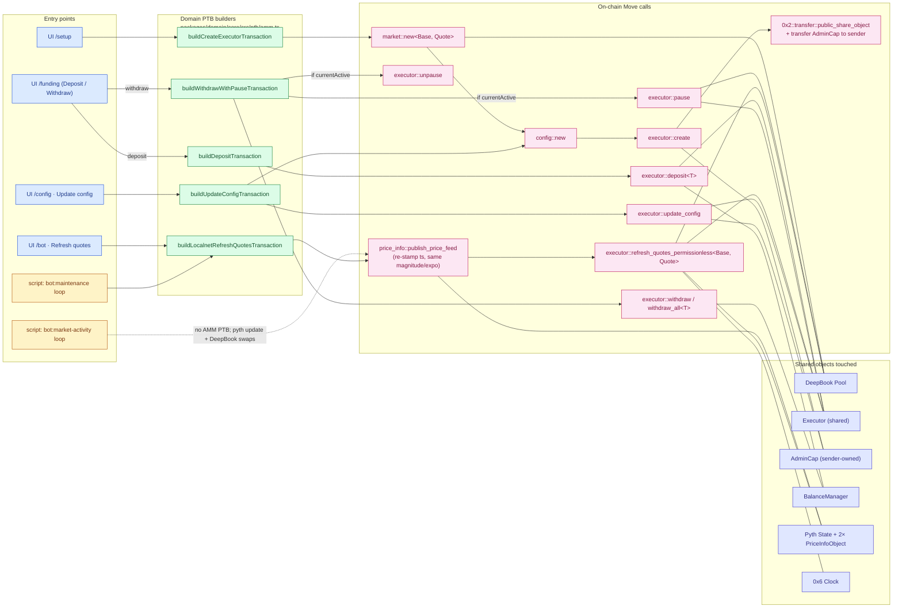

# Architecture

## What this AMM is

A **Proprietary Automated Market Maker (Prop AMM)** is a market-making strategy
embedded directly in a Move contract. Unlike a constant-product or concentrated
LP pool that's driven by a passive curve, this AMM keeps **two pairs of limit
orders** — a tight *inner* ring and a wider *outer* ring — sitting on a real
DeepBook order book, and re-prices them whenever the on-chain Pyth oracle
updates.

The result behaves like a single-operator desk:

- Quotes follow oracle truth, not internal pool inventory drift.
- Volatility (Pyth's confidence ratio) widens the outer ring without abandoning
  the inner one.
- Inventory imbalance shifts the *reservation mid* toward the side that needs
  to rebalance — the AMM offers more attractive prices to the side that
  brings inventory back to neutral.

## Core ideas

### 1. Mid price comes from Pyth, not from a curve

`market::new<Base, Quote>` records two Pyth feed identifiers (one per asset)
inside a `Market` struct. Every quote refresh reads the on-chain
`PriceInfoObject` for each feed, asserts a `max_price_age_secs` freshness
bound, and combines them into a single mid price. There is no internal
constant-product curve — the AMM is purely an *oracle taker*.

### 2. Two ring orders per side: inner + outer

For a given mid `m` and combined Pyth confidence ratio `c`:

- **Inner spread** = `m × base_spread_bps / 10_000` — the tight ring placed
  closest to mid. This is the AMM's "core liquidity".
- **Outer spread** = `m × (base_spread_bps + volatility_multiplier_bps × c / 10_000) / 10_000`
  — the volatility-buffered ring placed further out. It absorbs aggressive
  takers without forcing the inner ring to pull during temporary volatility.

The inner band gets `(10_000 − outer_balance_bps) / 10_000` of the available
side balance; the outer gets the remainder.

### 3. Inventory-skewed reservation mid

When the BalanceManager's base and quote sides are unbalanced (valued in
quote units at the oracle mid), the AMM shifts the *reservation mid* toward
the side that rebalances:

```
reservation_mid = m − base_spread × inventory_skew_bps × (base_value − quote_value)
                                                       / (base_value + quote_value)
                                                       / 10_000
```

The shift is bounded by `base_spread`, so the inner order on the rebalancing
side never lands beyond the oracle mid. With `inventory_skew_bps = 0` the
reservation mid equals the oracle mid (no skew).

### 4. Permissionless refresh, owner-gated funds

The `executor::refresh_quotes_permissionless<Base, Quote>` function is
**callable by anyone** — keepers, the trader's own bot, or a dispatcher
contract — so quote freshness doesn't depend on a single hot wallet. The
shared `Executor` carries the `Market`, `AMMConfig`, and an embedded
DeepBook `BalanceManager`; the `AdminCap` (transferred to the creator at
construction) gates only privileged ops: deposits, withdrawals, pause,
unpause, and config updates.

## Move module layout

```
packages/dapp/contracts/prop-amm/sources/
  market.move      Market<Base, Quote>: pool id + Pyth feed ids + cached
                   decimals + last seen publish times.
  config.move      AMMConfig: bps params (base/volatility spread, outer
                   balance, inventory skew, order TTL, max age, max conf).
  executor.move    Executor (shared): wraps Market, AMMConfig, embedded
                   BalanceManager + DeepBook caps, Info storage.
                   Public fns: deposit<T>, withdraw<T>, withdraw_all<T>,
                   pause, unpause, refresh_quotes_permissionless<Base,Quote>,
                   update_config.
  info.move        Info: lifetime volume + per-side deposited/withdrawn
                   counters, used by the /performance UI page.
  events.move      ExecutorCreated, QuoteUpdated, ExecutorPaused,
                   ExecutorUnpaused, ExecutorConfigUpdated, Deposited,
                   Withdrawn — the only things the UI/bots subscribe to.
```

## PTB flow

Every UI action and every long-running bot script funnels through the same
domain-level PTB builders in
[`packages/domain/core/src/ptb/amm.ts`](../packages/domain/core/src/ptb/amm.ts),
which in turn produce a fixed set of on-chain Move calls:



> GitHub renders the diagram inline. In VS Code, install
> `bierner.markdown-mermaid` to see it in the built-in preview.

## Why these design choices

### Why `Executor` is a shared object instead of owner-owned

A shared `Executor` lets *any* address call
`refresh_quotes_permissionless`, so quote freshness can be incentivised
externally (a paid keeper, a dispatcher contract, the trader's own
maintenance bot) without handing out hot keys. Sensitive ops still require
the `AdminCap`, which the creator keeps in their wallet.

### Why two rings instead of one

A single ring forces a tradeoff: tight enough to win flow in calm markets
but vulnerable to adverse selection during volatility, or wide enough to
survive a Pyth confidence spike but unable to compete when the book is
quiet. The inner+outer split lets the AMM keep tight quotes for the small
*inner balance* slice while the rest sits at the volatility-buffered outer
price. When confidence widens the outer, the inner keeps making markets;
when confidence collapses to zero, both rings collapse onto each other.

### Why inventory-skew is bounded by `base_spread`

If the skew could exceed `base_spread`, the inner order on the rebalancing
side would land *beyond* the oracle mid — the AMM would be quoting a worse
price than the oracle on its own incentivized side. Bounding the shift at
exactly `base_spread` ensures the inner order touches the mid in the
extreme case but never crosses it.

## Reference layout for code

| Concern | Location |
|---|---|
| Move sources | [packages/dapp/contracts/prop-amm/sources](../packages/dapp/contracts/prop-amm/sources) |
| PTB builders | [packages/domain/core/src/ptb/amm.ts](../packages/domain/core/src/ptb/amm.ts) |
| Executor / Market models | [packages/domain/core/src/models](../packages/domain/core/src/models) |
| UI hooks (one per PTB) | [packages/ui/src/app/hooks](../packages/ui/src/app/hooks) — `useCreateExecutorState`, `useFundingState`, `useBotControlState`, `useUpdateAmmConfigModalState`, `useRefreshQuotesState` |
| Localnet maintenance bot | [packages/dapp/src/scripts/bot/maintenance.ts](../packages/dapp/src/scripts/bot/maintenance.ts) |
| Localnet market-activity bot | [packages/dapp/src/scripts/bot/market-activity.ts](../packages/dapp/src/scripts/bot/market-activity.ts) |

## Where to go next

- [Overview & UI walkthrough](OVERVIEW.md) — page-by-page guide to the dApp.
- [Top-level README](../README.md) — Quickstart, env vars, market-activity testing recipe.
