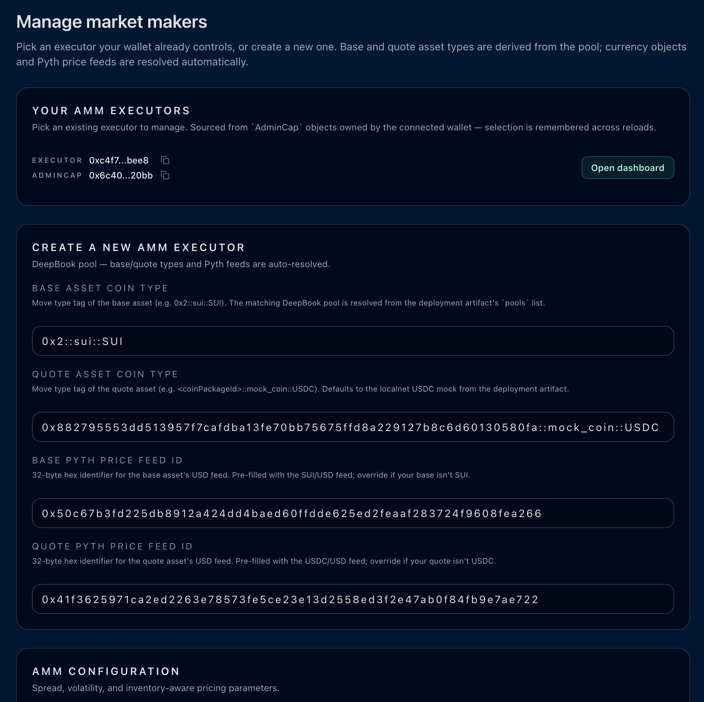
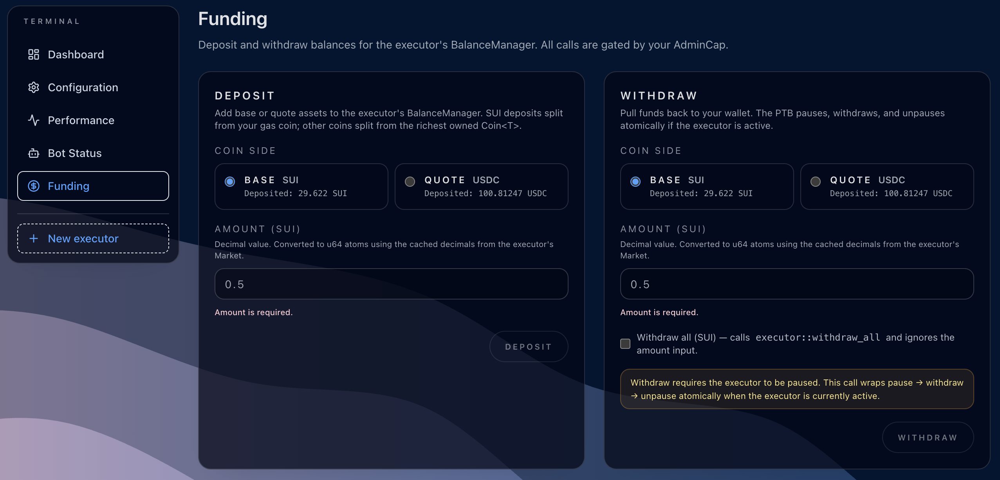
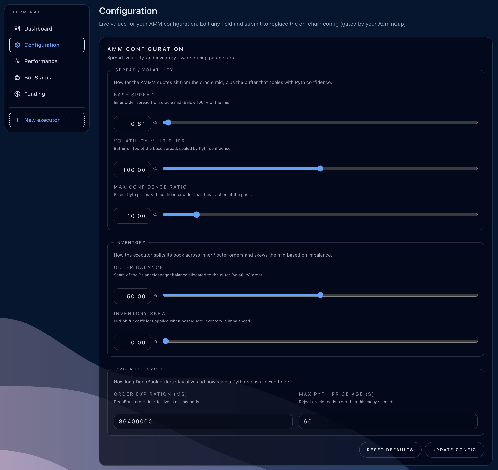
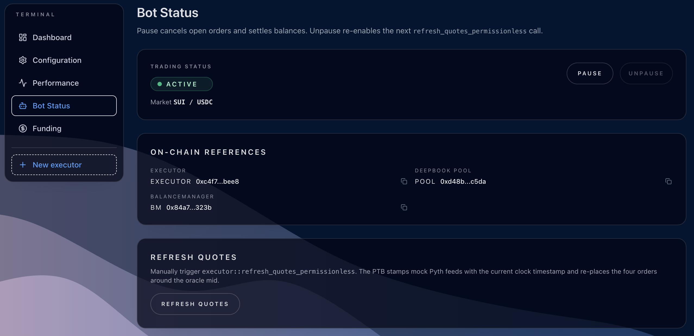
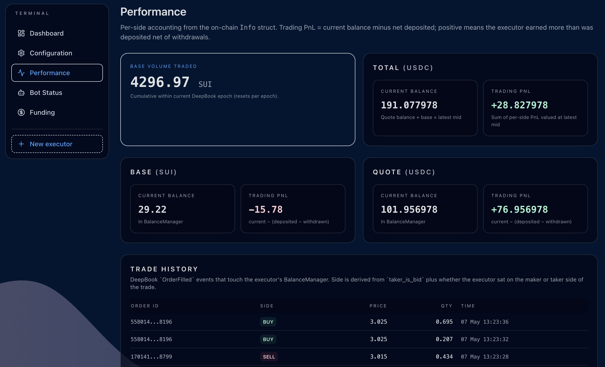

# dApp overview

A page-by-page tour of what the UI lets you do once you've completed the
[Quickstart](../README.md#quickstart-localnet) and connected a wallet. Each
page reads its data live from chain (no backend) and submits PTBs through
the connected wallet.

For the design decisions behind the on-chain contracts, see
[ARCHITECTURE.md](ARCHITECTURE.md).

## /setup — Create an AMM Executor

The landing page when no executor is yet bound to your wallet. Pick the
default DeepBook pool to make markets on, paste the Pyth feed-id hexes
for each side, set the AMM parameters, and submit a single PTB that
publishes the `Market`, the `AMMConfig`, the shared `Executor`, and
transfers the `AdminCap` to your address.

What you do here:

- **Base / quote coin types** auto-fill from `mock.localnet.json` on
  localnet (SUI / USDC) and can be overridden manually for other pools.
- **Pyth feed-id hex** for SUI/USD and USDC/USD comes from
  https://docs.pyth.network/price-feeds/core/price-feeds/price-feed-ids
  — the same hex works on localnet because the pyth-mock seeds the same
  identifiers.
- **AMM parameters** all use bps for spreads / shares and seconds (or ms)
  for time bounds. Defaults are sensible for SUI/USDC; tweak them on
  `/config` after the executor is live without re-creating it.

## /dashboard — Live state

Once the executor exists, this is where you'll spend most of your time.
Mid price (oracle line + DeepBook line + the inner/outer spread bands the
AMM is currently posting), inventory split, the four orders attached to the
latest `QuoteUpdated`, and the on-chain event log all auto-update from
chain polling.

What you do here:

- Click any legend pill (DeepBook, Inner spread, Outer spread) to toggle
  that series on/off and re-zoom the y-axis.
- Inspect the four open orders the AMM is currently quoting — two bids,
  two asks, with prices that match the inner+outer ring math
  (`m ± inner_spread`, `m ± outer_spread`).
- Watch `QuoteUpdated`, `Deposited`, `Withdrawn` events stream in as the
  bots / wallet activity fires them.

## /funding — Deposit and withdraw

Move base or quote coins between the connected wallet and the executor's
embedded `BalanceManager`. The AMM only quotes against funds it actually
holds, so this is the gate between "executor exists" and "AMM makes a
market".

What you do here:

- **Deposit** picks the richest coin object of the chosen type from your
  wallet and sends an `executor::deposit<T>` PTB.
- **Withdraw** runs `executor::withdraw<T>` / `executor::withdraw_all<T>`,
  wrapped between `pause` and `unpause` automatically when the executor
  is currently active so the BalanceManager unlocks for the duration of
  the call without leaving you in a paused state.

## /config — Update AMM config

Live re-tune of the AMM parameters without recreating the executor.
Everything you set on `/setup` is editable here; the form is grouped so
spread/volatility, inventory, and order-lifecycle params don't crowd each
other.

What you do here:

- Adjust `base_spread_bps` / `volatility_multiplier_bps` to tighten or
  loosen the rings.
- Move `outer_balance_bps` to change the inner-vs-outer balance split.
- Crank `inventory_skew_bps` up to make the AMM rebalance harder when one
  side is heavy.
- **Reset defaults** restores the form to the values from
  `buildAmmConfigFormState()` without writing on chain — review before
  hitting **Update config**.

## /bot — Bot Status & manual refresh

Pause/unpause the executor and trigger an off-cycle quote refresh from the
UI (the same code path the maintenance bot uses on a timer). Useful when
you want to see a single fresh quote without spinning up the bot.

What you do here:

- **Refresh quotes** runs `executor::refresh_quotes_permissionless<Base,
Quote>` immediately. Pyth `PriceInfoObject` timestamps get re-stamped in
  the same PTB so the executor's `assert_price_age_within_limit` doesn't
  abort.
- **Pause / Unpause** toggles trading. While paused the existing orders
  stay live on the book but no new refreshes can run; **Withdraw all** on
  `/funding` is the typical reason to pause.

## /performance — Cumulative metrics

Reads `Info` (the executor's lifetime accounting struct) plus events to
chart cumulative volume, deposited vs withdrawn flow per side, and
realised PnL approximations.

What you do here:

- Watch how aggressively the AMM is being filled — high `volume_base`
  with flat inventory means the rings are catching flow on both sides.
- Compare deposited vs withdrawn to spot one-sided drift.

## Where to go next

- [ARCHITECTURE.md](ARCHITECTURE.md) — the AMM's design rationale and PTB
  flow diagram.
- [Top-level README](../README.md) — install / Quickstart / market-activity
  bot recipe.
